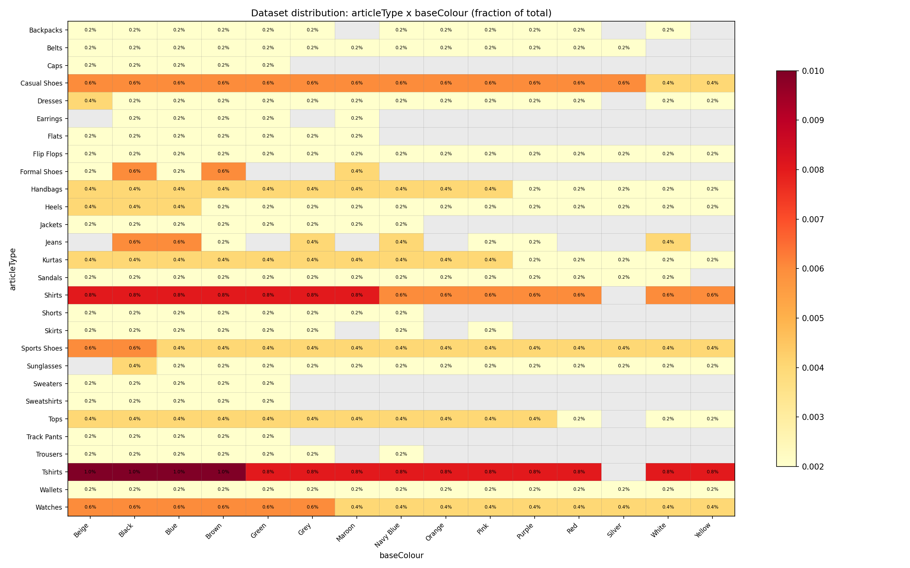
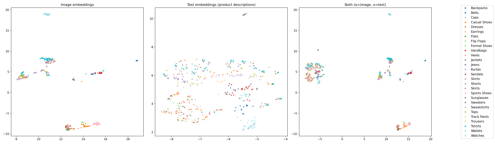
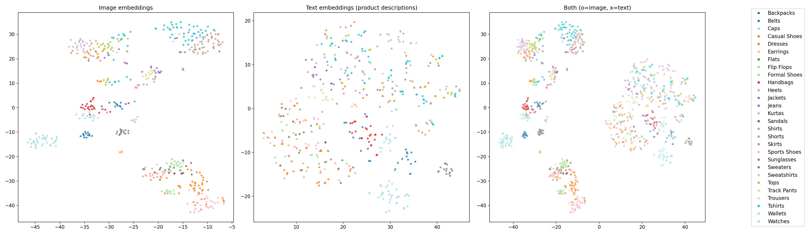
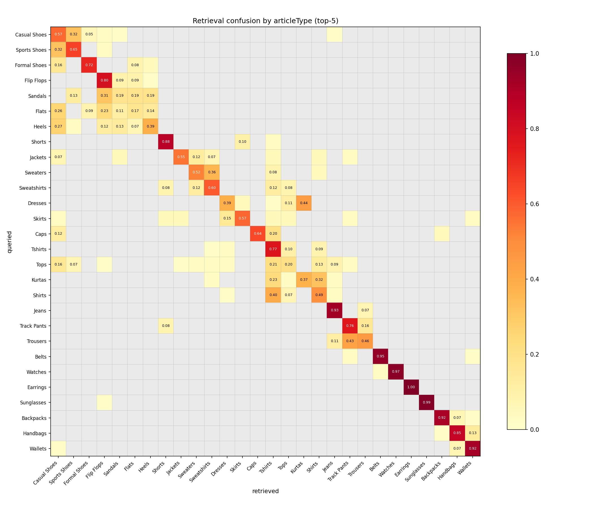
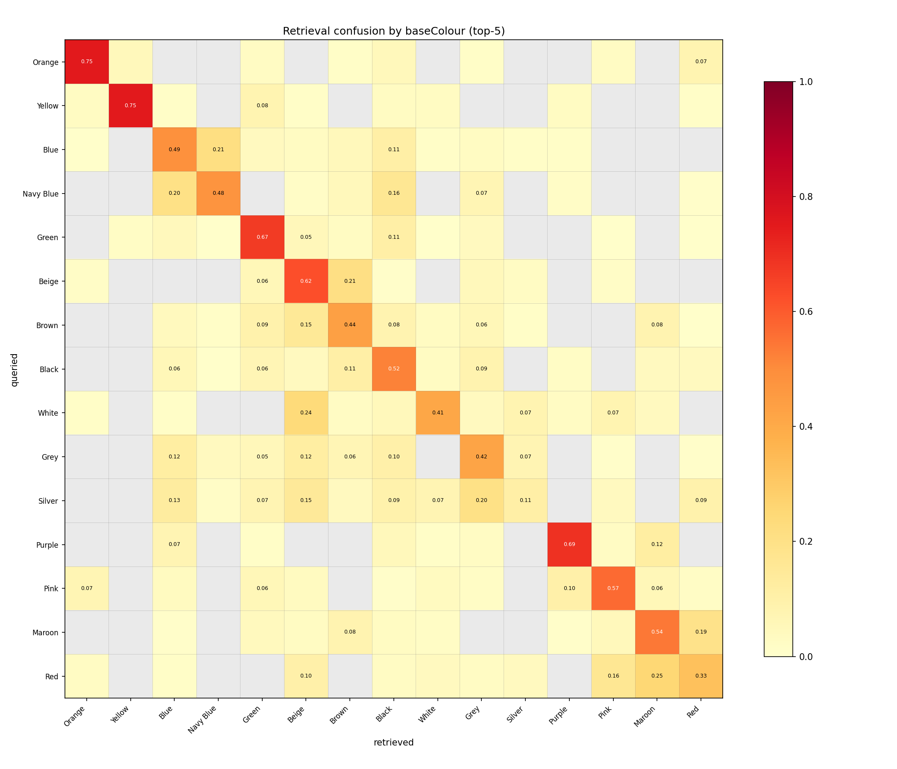

# Evaluation

## Dataset

The data comes from the [Kaggle Fashion Product Images Dataset](https://www.kaggle.com/datasets/paramaggarwal/fashion-product-images-dataset) (~44k products). A stratified sampling script was used to select a 500-item subset with colour-diverse, proportional allocation across 28 article types and 18 colours, with boosted floors for query-friendly categories (dresses, jeans, handbags, etc.).

The resulting catalogue is intentionally uneven -- T-shirts and casual shoes dominate, while categories like flats and trousers have only a handful of items.

  

## Embedding Space

CLIP maps both images and text into a shared 512-dimensional space. The UMAP and t-SNE projections below show how product images and their text descriptions cluster. Categories with distinctive visual features (backpacks, watches, flip flops) form tight clusters; visually similar categories (shirts, tops, kurtas) overlap.

  

  

## Category Retrieval

For each colour + article type combination in the catalogue (e.g. "Yellow Watches"), encode the text as a CLIP query and retrieve the top-10 most similar images. Measure how early a correct result appears using MRR (Mean Reciprocal Rank).

| Metric | Score |
|--------|-------|
| MRR@10 (both match) | 0.542 |
| MRR@10 (colour only) | 0.732 |
| MRR@10 (type only) | 0.767 |
| Mean Recall@10 | 0.688 |

CLIP retrieves the right article type 77% of the time and the right colour 73% of the time on the first result. Combined matching is harder -- when both must be correct, MRR drops to 0.54.

**Where it works well:** Visually distinctive combinations like "Yellow Watches" (MRR=1.0), "Black Formal Shoes" (1.0), and "Purple Sports Shoes" (1.0) are retrieved perfectly.

**Where it struggles:** Visually ambiguous queries like "Grey Shirts" (MRR=0.0), "White T-shirts" (0.0), and "Navy Blue Kurtas" (0.0) fail entirely ([full results](eval-outputs/eval_categories.txt)). 

The failures fall into clear patterns:
- **Visual near-synonyms:** grey vs silver, navy blue vs blue, beige vs white
- **Taxonomy vs appearance:** shirts vs tops vs kurtas look similar despite being different categories

The confusion matrices below show where retrieval errors land. For each query (row), the top-5 retrieved items are tallied by their actual attribute (column) and normalised by the number of results. Each matrix marginalises over the other feature: the article type matrix aggregates across all colours (so the "Shirts" row combines results from "Grey Shirts", "Blue Shirts", etc.), and the colour matrix aggregates across all article types. A perfect system would show values only on the diagonal. Off-diagonal mass reveals which categories CLIP confuses -- e.g. shirts retrieving tops, or grey retrieving black. Rows and columns are reordered by hierarchical clustering (of the rows using linkage) so that frequently confused groups appear adjacent.

  
  

## Description Retrieval

For each of the 500 items, use the product display name (e.g. "Nike Men Blue Running Shoes") as a query and check if the item's own image appears in the top-10.

| Metric | Score |
|--------|-------|
| MRR@10 | 0.548 |
| Hit@1 | 0.462 |
| Hit@10 | 0.812 |

81% of items are found somewhere in the top-10 results for their own description. 46% are the top result. On average they are at the 1/0.548 = 1.82 place.

**By category:**

| Category | MRR | Count | | Category | MRR | Count |
|----------|-----|-------|-|----------|-----|-------|
| Backpacks | 1.000 | 24 | | Watches | 0.520 | 72 |
| Sweaters | 1.000 | 10 | | Sandals | 0.515 | 28 |
| Caps | 0.867 | 10 | | Belts | 0.493 | 26 |
| Shorts | 0.833 | 16 | | Sunglasses | 0.461 | 30 |
| Sweatshirts | 0.800 | 10 | | Casual Shoes | 0.421 | 86 |
| Skirts | 0.778 | 16 | | Flats | 0.378 | 14 |
| Wallets | 0.754 | 30 | | Heels | 0.353 | 36 |
| Jackets | 0.726 | 16 | | Formal Shoes | 0.329 | 20 |
| Flip Flops | 0.672 | 30 | | Shirts | 0.321 | 98 |

Categories with distinctive silhouettes (backpacks, caps) score highest. Categories where items look alike (formal shoes, shirts) score lowest -- CLIP can't distinguish between two similar black formal shoes from text alone ([full results](eval-outputs/eval_descriptions.txt)).

## Alternative Approaches

Three directions that would likely improve retrieval quality:

### Image-only model for image queries

The system currently uses CLIP's image encoder for image-to-image retrieval ("find similar" searches directly in image embedding space via BigQuery `VECTOR_SEARCH`). However, CLIP's image encoder was trained for cross-modal alignment with text, not purely for visual similarity. A vision-only model like DINOv2, which is trained via self-supervised learning on images alone, would produce embeddings optimised for visual structure rather than text-image correspondence. This could improve "more like this" results for cases where visual similarity matters more than semantic category, e.g. finding items with a similar pattern, texture, or silhouette regardless of how they'd be described in words.

### Google's multi-modal embedding model

Vertex AI offers a [multi-modal embedding model](https://cloud.google.com/vertex-ai/generative-ai/docs/embeddings/get-multimodal-embeddings) trained on a broader and more recent dataset than CLIP ViT-B/32. Using it would trade self-hosted inference for an API call, removing the need to manage model weights in containers. The embedding dimensions and quality characteristics differ. It would be interesting to benchmark against CLIP on this catalogue to see whether fashion-domain performance improves out of the box.

### Fine-tuning CLIP on fashion data

The eval reveals systematic failure modes (colour near-synonyms, taxonomy confusion) that stem from CLIP's general-purpose training. Contrastive fine-tuning on fashion image-text pairs would teach the model domain-specific distinctions. The existing metadata provides free supervision: pair each image with its product name and use in-batch negatives. Hard-negative mining on the confused categories (shirts vs tops, grey vs silver) would target exactly the failures the eval identifies. With only 500 items, a frozen image encoder with a fine-tuned text projection or LoRA adapters would be more practical than full fine-tuning.

Clip was actually already trained tuned for the full version of this dataset. See [fashion-clip](https://huggingface.co/patrickjohncyh/fashion-clip). This model could be an in-place replacement (just a config change)!

