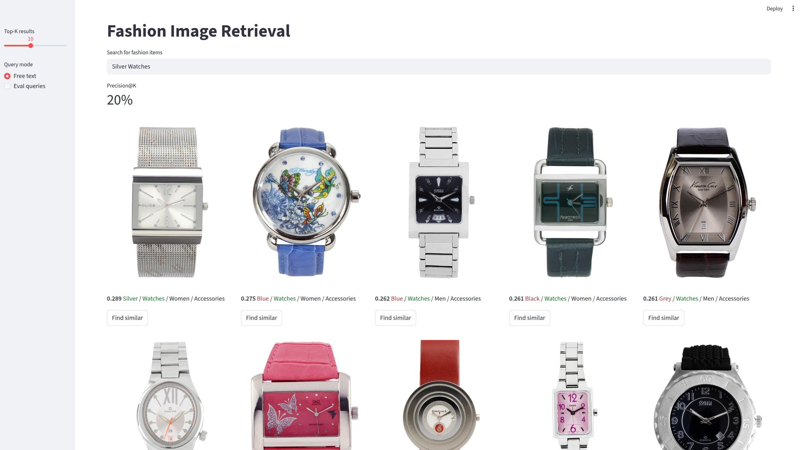
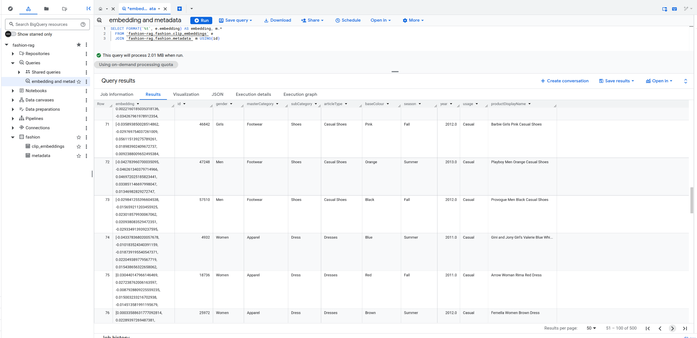
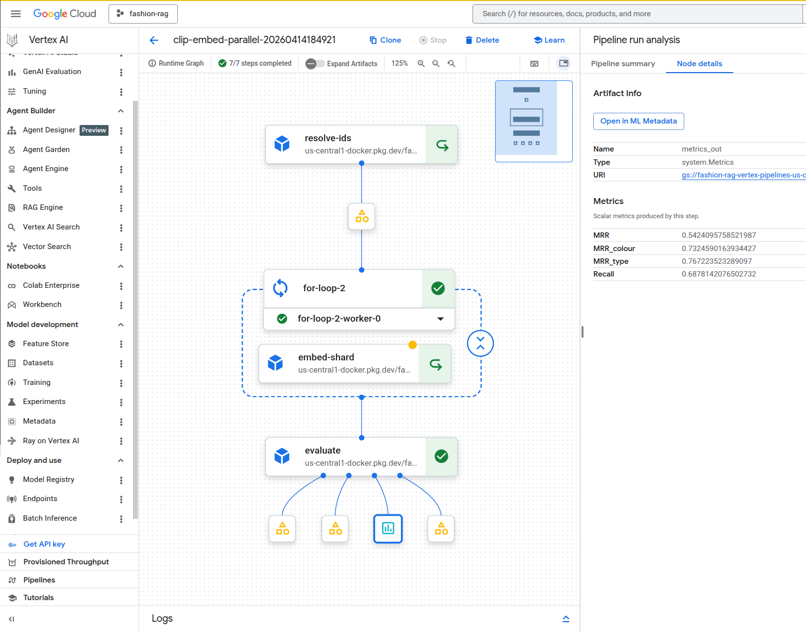
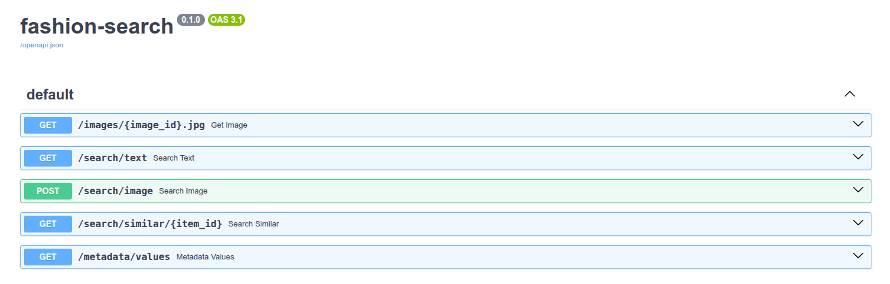

# Multi-Modal Fashion Product Retrieval on GCP
The code base implements a cross-modal product retrieval system where users describe what they're looking for in natural language, "red summer dress" or "Colourful shoes", and the system returns the most visually matching products from a catalogue. Users can also select a result and find visually similar items via "more like this" image-to-image search. Metadata that accompanies the images serves for evaluation purposes but is not used in search.

<p align="center">
  
</p>

## Why

Product search is fundamentally a cross-modal problem: customers think in words, catalogues are organised around images. Traditional keyword search relies on metadata being complete and consistent, which it rarely is. Embedding-based retrieval bridges this gap by mapping both text queries and product images into a shared vector space where semantic similarity can be measured directly.

This project demonstrates a complete system lifecycle from data ingestion through embedding generation to interactive search and evaluation - built on GCP-native services. It demos on a small (500 image) catalog but designed with scale up in mind.

## Design Decisions

- **CLIP for cross-modal embeddings** maps images and text into a shared 512-dimensional space, enabling zero-shot retrieval without task-specific training. The tradeoff is that CLIP was trained on general web data, not fashion, which leads to instructive failure modes.

<p align="center">
  
</p>
- **BigQuery as the vector store** rather than introducing a dedicated vector database, embeddings are stored alongside product metadata in BQ. This keeps the data layer in one place, enables retrieval quality analysis in SQL, and stays GCP-native.
- **Metadata-based automated evaluation** the dataset includes structured attributes (colour, article type, season, gender) for every product. These serve as ground truth to automatically measure retrieval precision: if a user searches "blue sneakers," we check whether returned items are actually blue and actually sneakers. A more comprehensive eval runs in the extraction pipeline. Full results and analysis are in [EVAL.md](EVAL.md).
- **Core functionality can run local** using GCS and BQ as data sources. This enables faster development speed. Vertex components are just wrappers. The api and app can run local or in-Docker or deployed to Google Cloud Run.

## Architecture

GCP assets are instantiated with code (found in the [Makefile](Makefile)).

**Data layer** Product images in GCS (`gs://fashion-data-500/images/`), metadata and 512-d CLIP embeddings in BigQuery. BQ doubles as the vector store via native `VECTOR_SEARCH`.

<p align="center">
  
</p>

**Embedding pipeline** A Vertex AI / KFP pipeline (`vertex/pipelines/clip_embed.py`) runs CLIP ViT-B/32 (HuggingFace Transformers, PyTorch) with parallel sharding, writing embeddings to BQ incrementally. Evaluation against metadata is also carried out in the pipeline (or locally).

<p align="center">
  
</p>

**Serving** A FastAPI service handles text-to-image and image-to-image retrieval, encoding queries with CLIP at inference time. A Streamlit app provides a thin interactive frontend. Both deploy to Cloud Run (scale-to-zero) with images stored in Artifact Registry.

<p align="center">
  
</p>

### Code arrangement

```
fashion-rag/
├── src/fashion_rag/        # Core library: embedding, search, config
├── api_server/             # FastAPI REST endpoints
├── app/                    # Streamlit UI (calls the API)
├── vertex/                 # KFP pipeline components + Dockerfile
├── evals/                  # Evaluation scripts (MRR, confusion matrices, visualization)
├── eval-outputs/           # Generated plots and metrics
├── data/                   # Local dev data (500 images + metadata.csv)
├── tests/                  # Unit tests
├── Makefile                # GCP setup, build, deploy, and dev targets
└── pyproject.toml          # Dependencies with optional extras
```

**Packaging:** uv, hatchling, Docker | **Quality:** ruff, pytest, pre-commit hooks

## Quickstart

Requires Python 3.12+ and [uv](https://docs.astral.sh/uv/).

```bash
# Run locally (API + Streamlit)
make serve

# Run embedding pipeline on Vertex AI
make pipeline

# Deploy to Cloud Run
make deploy-api
make deploy-app
```

See `make help` or the Makefile for all available targets including one-time GCP setup (`make setup`, `make cloud-run-setup`).
