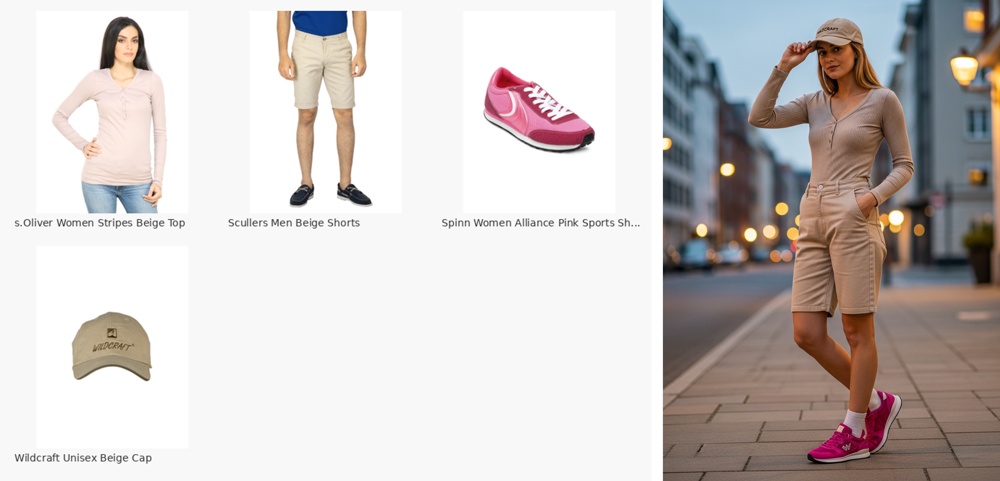

# Fashion Search — Claude Code Skill

A Claude Code skill that searches a fashion catalog and generates outfit images using the Fashion RAG API.



## Prerequisites

- Python 3.12+
- A running Fashion RAG API (either local or the deployed Cloud Run instance)
- A `GOOGLE_API_KEY` in `.env` at the repo root (required for outfit generation with Gemini + Imagen)

## Installation

```bash
# From the repo root
uv pip install httpx Pillow google-genai
```

Or if using the full project:

```bash
uv sync --extra app
uv pip install google-genai
```

## Setup

The skill file (`SKILL.md`) is symlinked into `.claude/skills/fashion-search/` so Claude Code picks it up automatically. No extra setup needed — just use `/fashion-search` in Claude Code.

## CLI Usage

The CLI can also be used standalone outside of Claude Code:

```bash
# Text search
python skill/cli.py --url https://fashion-rag-api-393797432022.us-central1.run.app text "red dress" --k 5

# Image search
python skill/cli.py --url https://fashion-rag-api-393797432022.us-central1.run.app image photo.jpg --k 3

# Generate an outfit (searches catalog, builds mood board, generates AI illustration)
python skill/cli.py --url https://fashion-rag-api-393797432022.us-central1.run.app outfit "beige top" "khaki shorts" "pink sneakers" -o agent-outputs/outfit.png
```

## Files

- `SKILL.md` — Skill definition (symlinked from `.claude/skills/fashion-search/SKILL.md`)
- `cli.py` — CLI client for the Fashion RAG API
